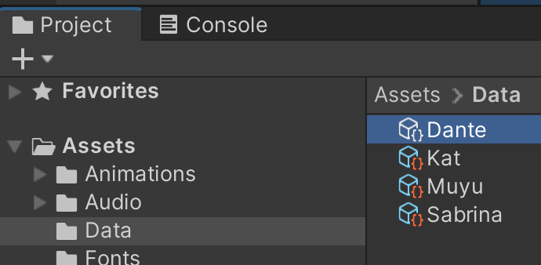

# Player Spaceship

There are 4 characters to choose from:
<table>
  <tr>
    <th>
      
    </th>
    <th>
      
    </th>
    <th>
      
    </th>
    <th>
      
    </th>
  </tr>
  <tr>
    <th>
      
Kat

    </th>
    <th>
      
Dante

    </th>
    <th>
      
Sabrina

    </th>
    <th>
      
Muyu

    </th>
  </tr>
</table>

Because of this, we create a scriptableobject for setting the data of every character, in this system you can create more characters or edit the ones created:

 

The player ship has different values that can be modified from the inspector:

### Data
* `Character sprite`: sprite used on the selection screen

* `Character ship sprite`: sprite of the ship use on the selections creen
  
* `Icon sprite`: sprite use on the health UI

* `Icon death sprite`: Sprite use on the health UI when dead

* `Character name`: Name of the character

* `Spaceship prefab`: spaceship prefab use in the gameplay scene

* `Spaceship score prefab`: prefab use on the victory/defeat screen

* `Color`: color to identify the character use on different UI and effects

* `Dark color`: alternative color to identify the character used on different UI and effects.

### Client Info
* `ClientId`: id of the client who select this character

* `PlayerId`: player id of this character can only be (1,2,3 or 4)

* `IsSelected`: a boolean to check if this character is selected.

### Score
* `Enemies destroyed`: number of enemies this character destroys

* `Power ups used`: number of power ups the player use

 

And you can create a new spaceship file by clicking on :`Assets/Galactic Kittens/Character Data` from the editor main toolbar or `Create/Galactic Kittens/Character Data` by right-cliking on the Project window.