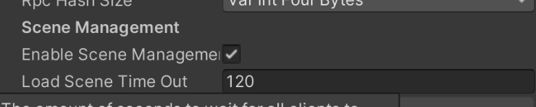
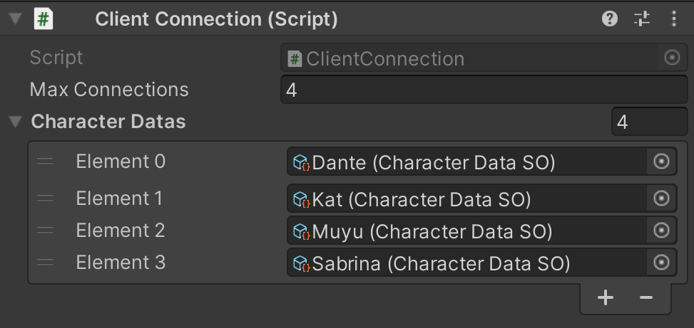

# Connection Flow
The connection of clients starts with the `MenuManager` script where a player can start a new session as a `host` or join an existing session  as a `client`. This script makes the calls to the NetworkManager commands `StartHost()` or `StartClient()`, which come built in with the Netcode library:

The main menu you see when you start the game:


Calls the `MenuManager` script in the back-end:
```C#
public class MenuManager : MonoBehaviour
{
    ...

    public void OnClickHost()
    {
        NetworkManager.Singleton.StartHost();
        AudioManager.Instance.PlaySoundEffect(m_confirmClip);
        LoadingSceneManager.Instance.LoadScene(nextScene);
    }

    public void OnClickJoin()
    {
        AudioManager.Instance.PlaySoundEffect(m_confirmClip);
        StartCoroutine(Join());
    }

    ...

    // We use a coroutine because the server is the one who makes the load
    // we need to make a fade first before calling the start client
    private IEnumerator Join()
    {
        LoadingFadeEffect.Instance.FadeAll();

        yield return new WaitUntil(() => LoadingFadeEffect.s_canLoad);

        NetworkManager.Singleton.StartClient();
    }
}
```

When a host starts the network session it is created and it loads the next scene, `CharacterSelection`.

When a client joins the active session, it automatically is sent to the scene where the host is. This happens because we have selected that the `NetworkManager` takes care of it. The NetworkManager by default has automatic scene management enabled:


> Developers can disable this option and manually handle changing scenes. But it would affect the flow of the game, potentially breaking it.

<br>

### Checking if Clients can Join

So we need to check if the client can join. We use the script `ClientConnection` to verify if the client is allowed to enter the session:

>In the editor on ClientConnection the developer can modify the number of clients permitted to join.

The `ClientConnection` has a method to check if the client is allowed to enter the game. We need to check two options, when the player is on the character selection screen and when the actual game starts. This is because when on the selection screen we check the network manager for the number of players connected and we determine if we are allowed to enter or not.

When the game starts we need to check the characters data instead to see if the player was already in the game:
```C#
public class ClientConnection : SingletonNetwork<ClientConnection>
{
    // Check if client can connect, there are two different ways to check
    // 1. On the selection screen, always check the network manager for the numbers of clients connected
    // 2. When the game starts after the character selection a new client should never be allowed to enter
    //    so we check the data of the characters because there we now witch character is selected and by who
    private bool CanConnect(ulong clientId)
    {
        if (LoadingSceneManager.Instance.SceneActive == SceneName.CharacterSelection)
        {
            int playersConnected = NetworkManager.Singleton.ConnectedClientsList.Count;

            if (playersConnected > m_maxConnections)
            {
                print($"Sorry we are full {clientId}");
                return false;
            }

            print($"You are allowed to enter {clientId}");
            return true;
        }
        else
        {
            if (ItHasACharacterSelected(clientId))
            {
                print($"You are allowed to enter {clientId}");
                return true;
            }
            else
            {
                print($"Sorry we are full {clientId}");
                return false;
            }
        }
    }

    ...

    
    // Check if the client exist on the characters data
    private bool ItHasACharacterSelected(ulong clientId)
    {
        foreach (var data in m_characterDatas)
        {
            if (data.clientId == clientId)
            {
                return true;
            }
        }

        return false;
    }
...
}
```

### Client Disconnect
When a client disconnects for the network session, we need to register to the event `OnClientDisconnectCallback` from the `NetworkManager`. This event is fire and we can catch which client disconnects and use it to control what will happen. 

>It's important to take note that when the server/host is shutdown by force *(pressing the close on the window or F4)* this event does not fire and the clients can't do anything, only force-close to the game.

<br>

The `CharacterSelectionManager` and `GameplayManager` register to the event and control what to do in case a client leaves the game.

For the `CharacterSelectionManager` the game needs to remove the client and update the UI and characterData on server and all clients:
```C#
public class CharacterSelectionManager : SingletonNetwork<CharacterSelectionManager>
{
    ...

    public override void OnNetworkSpawn()
    {
        if (IsServer)
        {
            NetworkManager.Singleton.OnClientDisconnectCallback += PlayerDisconnects;
        }
    }

    ...

    public void PlayerDisconnects(ulong clientId)
    {
        if (!ClientConnection.Instance.IsExtraClient(clientId))
            return;

        PlayerNotReady(clientId, isDisconected: true);

        m_playerStates[GetPlayerId(clientId)].playerObject.Despawn();

        // The client disconnected is the host
        if (clientId == 0)
        {
            NetworkManager.Singleton.Shutdown();
        }
    }
    ...
}
```

On the GameplayManager we need to defeat the player, then the player updates the UI and syncs to clients:
```C#
public class GameplayManager : SingletonNetwork<GameplayManager>
{
    ...

    private void OnEnable()
    {
        if (IsServer)
        {
            OnPlayerDefeated += PlayerDeath;
            NetworkManager.Singleton.OnClientDisconnectCallback += OnClientDisconnect;
        }
    }

    ...

    private void OnClientDisconnect(ulong clientId)
    {
        foreach (var player in m_playerShips)
        {
            if (player != null)
            {
                if (player.characterData.clientId == clientId)
                {
                    player.Hit(999); // Do critical damage
                }
            }
        }
    }
    ...
}
```