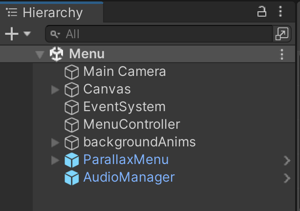
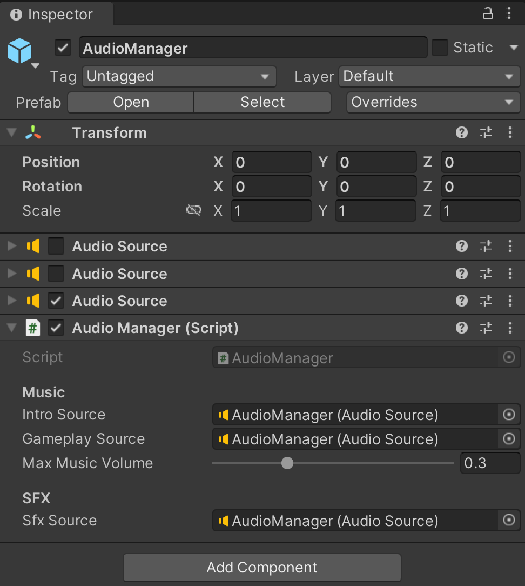

# AudioManager

The script controls all the audio from the game, for the background music we got a simple fade effect on changing between the 2 backgrounds.

If you wamt to play a sound effectm just call the `AudioManager.Instance.PlaySound(...)` function, passing in the desired audio clip and a volumen level with a default volume of `1.0` (*on a scale from 0.0 to 1.0*), which is the max level:
```C#
public void PlaySoundEffect(AudioClip clip, float volume = 1f)
{
    m_sfxSource.PlayOneShot(clip, volume);
}
```
This class is `persistent singleton` that gets initialized on the `Menu` scene in the project: 


In case it is needed to change the background music, the max music volume, or other audio/music settings, modify them in this scene:
