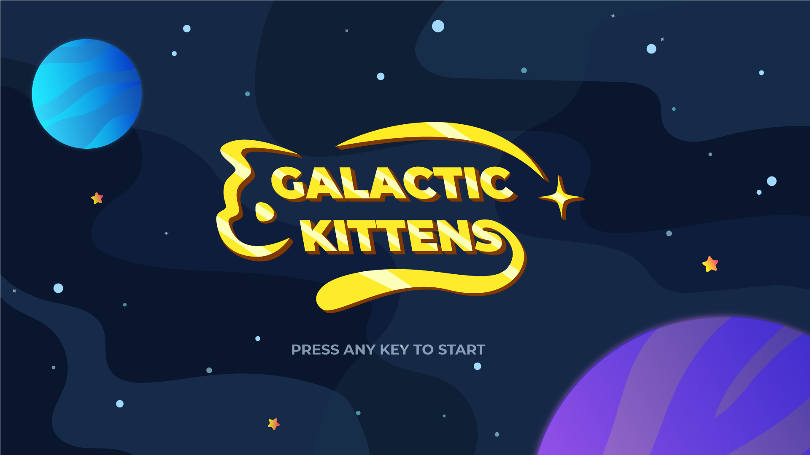

# Galactic Kittens
<!--
> IGNORE THIS
> 
> __Current Readme: [ ] Template__:
> - Services being used
> - Setting up the project
> - Wiki with documentation from development team (more details, links to particular sections/scripts)
> - Images
> - Architecture doc
> -->
<!--## Overview: -->
Galactic Kittens is a 2D co-op space adventure sample game where players must blast off to space and defeat all of the possible enemies in a small time range. This project was made using Netcode for Game Objects, our proprietary networking library. 

Galactic Kittens uses basic [Network Manager](https://docs-multiplayer.unity3d.com/docs/components/networkmanager) settings and is designed to help you learn how to apply and synchronize sprite animations, particle effects, and basic 2D movement.
 
 

---------------
## Services Used:
  * [Netcode for GameObjects](https://unity.com/products/netcode)

---------------
## Running the Project for the First Time
**From the Editor:**

1. Open the project. You can start with the latest **Unity Editor ver. 2020.3.XX**
2. Open the scene called `Bootstrap`. This scene sets up the NetworkManager Singleton.
3. Play the scene.
4. Press any key on the title screen.
5. When you reach the main menu, click on the **Host** button.
6. Select a character, using the *A* or *W* keys and then press the spacebar or click on the **Ready!** button below.
7. The game will automatically take you to the `Controls` scene, and then shortly after will transition to the main gameplay.

**From a Build:**
1. Open the project, preferably with Unity ver. 2020.3.26f1
2. Build the game as it is.
3. Open the output executable, and play the game. Follow the same steps as running from the editor to play the game, starting at step #4.

 
 

---------------
## Exploring the project
Galactic Kittens is a 4-player co-op action game experience, where players try to take down robot enemies, and then a dangerous boss that can launch missles! Players can select between the 4 space explorers that can fire lasers, and collect power ups that let them activate a spaceship shield that protects against 1 hit.

One of the four clients acts as the host/server. The game is mostly server-authoritative, with the exception of the main spaceships that the players control. Position updates are done through [ClientNetworkTransform](https://docs-multiplayer.unity3d.com/docs/components/networktransform#clientnetworktransform) components for the main characters, and regular [NetworkTransform](https://docs-multiplayer.unity3d.com/docs/components/networktransform) components for the other objects (enemies, power-ups, boss, etc.).

NetworkedVars and Remote Procedure Calls (RPC) endpoints are isolated in a class that is shared between the server and client specialized logic components. All game logic runs in FixedUpdate at 30 Hz, matching our network update rate. 

For an overview of the project's architecture please check out our [ARCHITECTURE.md](ARCHITECTURE.md).
 
 

---------------
## Additional Resources
* If you're entirely new to Netcode for GameObjects, we do recommend that you first go over our [documentation](https://docs-multiplayer.unity3d.com/docs/getting-started/about), and follow along the "Hello World" [tutorials](https://docs-multiplayer.unity3d.com/docs/tutorials/helloworld/helloworldintro).

* For further discussion points and to connect with the team, join us on the Unity Multiplayer Networking Discord Server - Channel #dev-samples

