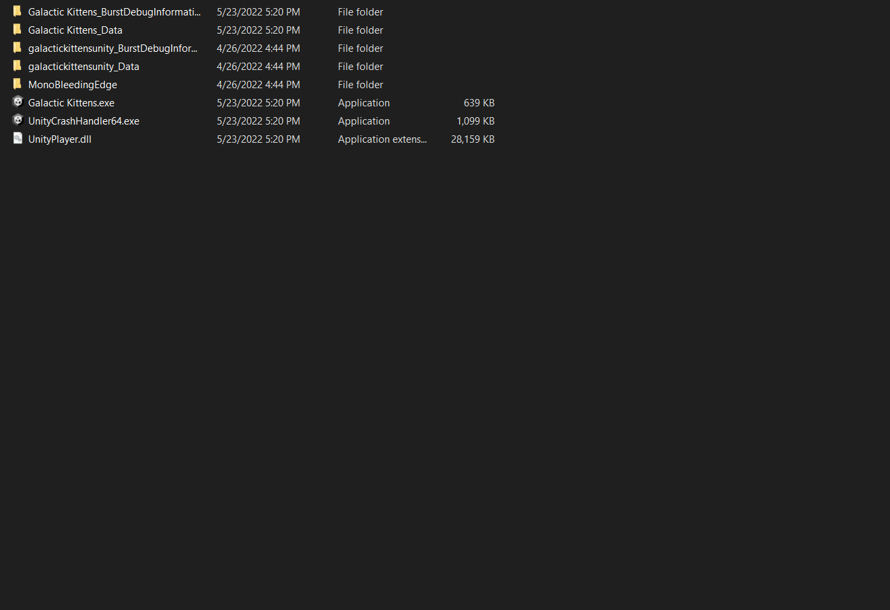
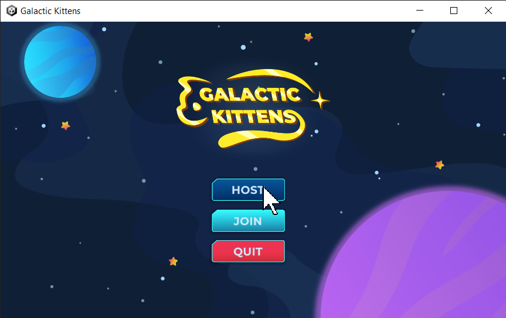
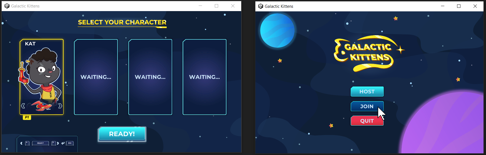
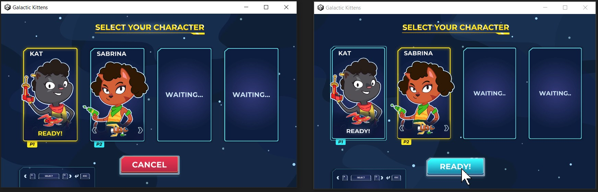
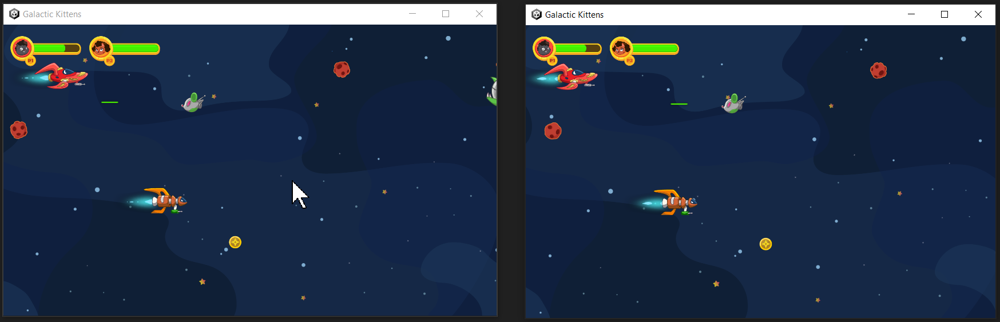

# Setup Instructions

**From the Editor:**

1. Open the project. You can start with the latest **Unity Editor ver. 2020.3**

2. Open the scene called `Bootstrap`. This scene sets up the [NetworkManager](https://docs-multiplayer.unity3d.com/netcode/current/components/networkmanager) Singleton.

3. Play the scene.

4. Press any key on the title screen.

5. When you reach the main menu, click on the **HOST** button:

6. Select a character, using the *A* or *W* keys and then press the spacebar or click on the **Ready!** button below.

7. The game will automatically take you to the `Controls` scene, and then shortly after will transition to the main gameplay.

**From a Build:**
1. Open the project. You can start with the latest **Unity Editor ver. 2020.3**

2. Open the build menu, by clicking on `File\BuildSettings...` on the main menu toolbar. Build the game as it is, by clicking on the `Build` button below:

3. Open the output executable, and play the game. Follow the same steps as running from the editor to play the game, starting at step **#4**.

**Testing Local Multiplayer:**

1. Build the game following the instructions above.

2. Open one instance of the game, and run it as the host, by clicking on the **HOST** button:

3. Open another instance of the game, and run it as the client, by clicking on the **JOIN** button:

4. The client instance will now join the host's networked session! Now select a character on both running instances, and  click on the **READY!** button:

5. Both instances will now automatically proceed to the gameplay stage, after displaying the controls:

6. You can try this with up to `4` concurrent instances!
