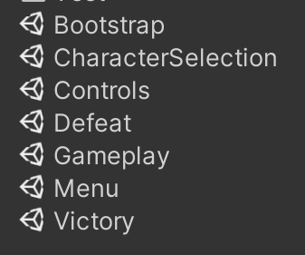
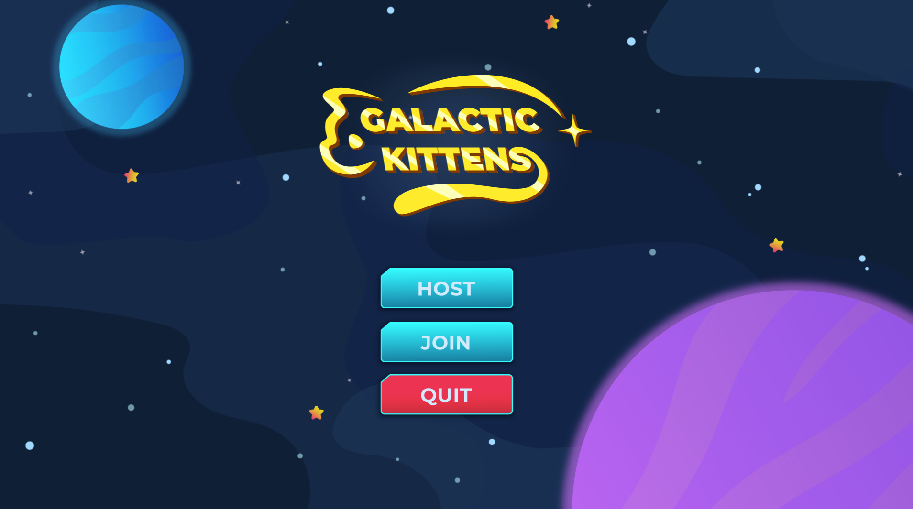
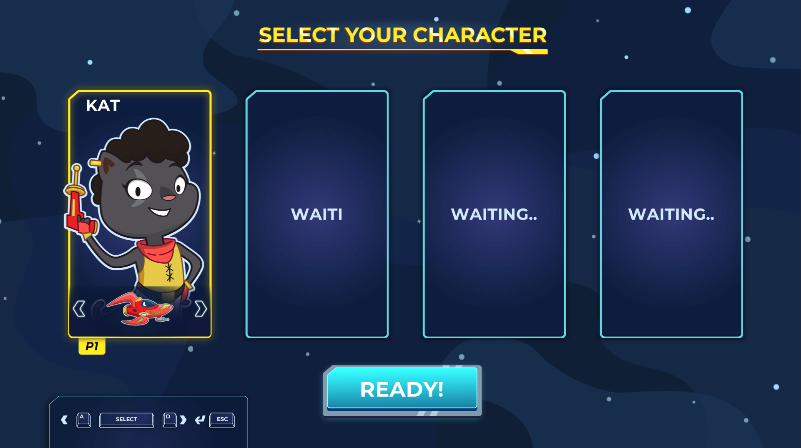
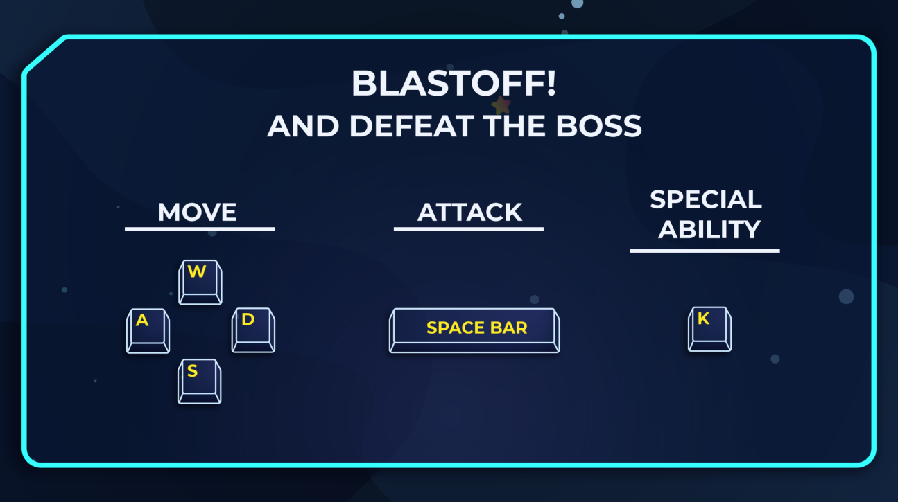
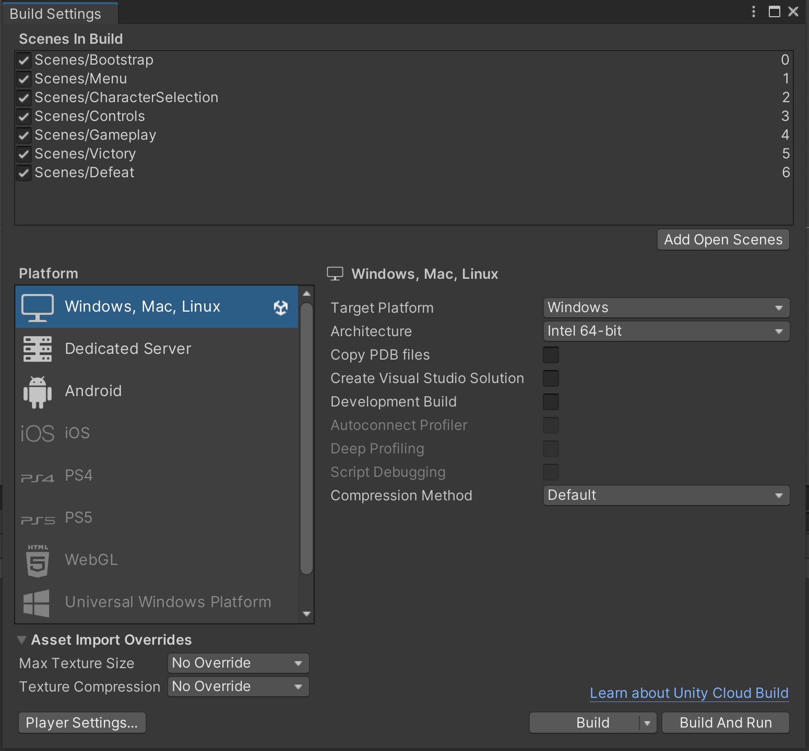

# Setup Instructions

**From the Editor:**

1. Open the project. You can start with the latest **Unity Editor ver. 2020.3**
2. Open the scene called `Bootstrap`. This scene sets up the NetworkManager Singleton.
 

3. Play the scene.

4. Press any key on the title screen.

5. When you reach the main menu, click on the **Host** button:

6. Select a character, using the *A* or *W* keys and then press the spacebar or click on the **Ready!** button below.

7. The game will automatically take you to the `Controls` scene, and then shortly after will transition to the main gameplay.

**From a Build:**
1. Open the project. You can start with the latest **Unity Editor ver. 2020.3**

2. Build the game as it is:

3. Open the output executable, and play the game. Follow the same steps as running from the editor to play the game, starting at step **#4**.